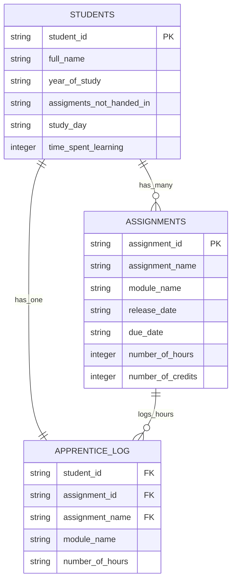

```mermaid
erDiagram
    STUDENTS ||--|| APPRENTICE_LOG : has_one
    STUDENTS ||--o{ ASSIGNMENTS : has_many
    ASSIGNMENTS ||--o{ APPRENTICE_LOG : logs_hours
    STUDENTS {
        string student_id PK
        string full_name
        string year_of_study
        string assigments_not_handed_in
        string study_day
        integer time_spent_learning
    }
    
    ASSIGNMENTS {
        string assignment_id PK
        string assignment_name 
        string module_name
        string release_date
        string due_date
        integer number_of_hours
        integer number_of_credits
    }
    
    APPRENTICE_LOG {
        string student_id FK
        string assignment_id FK
        string assignment_name FK
        string module_name
        string number_of_hours
    }
```